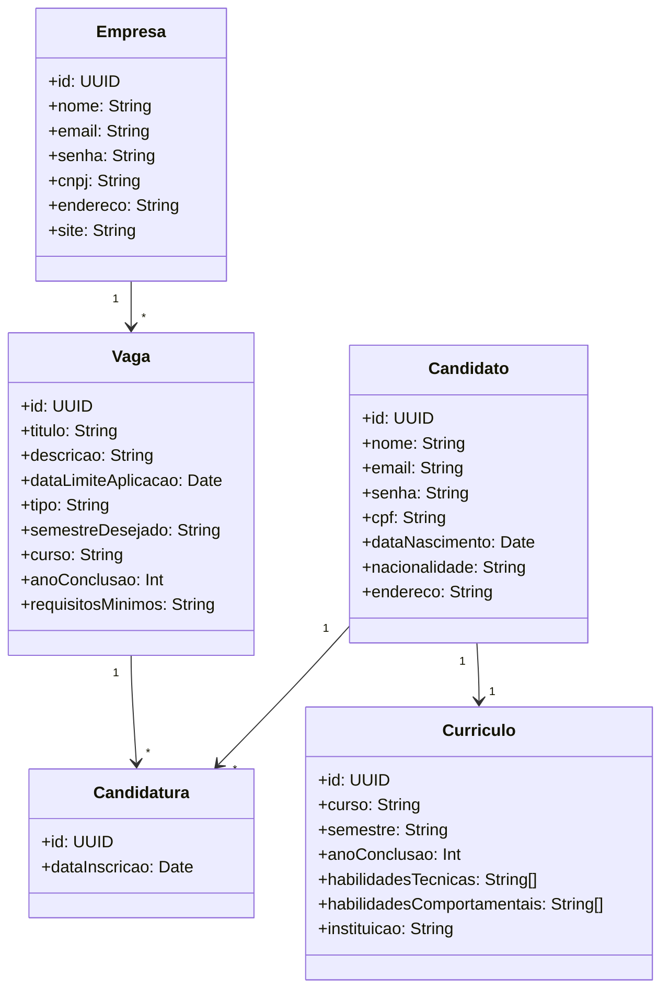

# temos-vagas

```mermaid
classDiagram

class Candidato {
  +id: UUID
  +nome: String
  +email: String
  +senha: String
  +cpf: String
  +dataNascimento: Date
  +nacionalidade: String
  +endereco: String
}

class Curriculo {
  +id: UUID
  +curso: String
  +semestre: String
  +anoConclusao: Int
  +habilidadesTecnicas: String[]
  +habilidadesComportamentais: String[]
  +instituicao: String
}

class Empresa {
  +id: UUID
  +nome: String
  +email: String
  +senha: String
  +cnpj: String
  +endereco: String
  +site: String
}

class Vaga {
  +id: UUID
  +titulo: String
  +descricao: String
  +dataLimiteAplicacao: Date
  +tipo: String
  +semestreDesejado: String
  +curso: String
  +anoConclusao: Int
  +requisitosMinimos: String
}

class Candidatura {
  +id: UUID
  +dataInscricao: Date
}

Candidato "1" --> "1" Curriculo
Empresa "1" --> "*" Vaga
Vaga "1" --> "*" Candidatura
Candidato "1" --> "*" Candidatura
```
